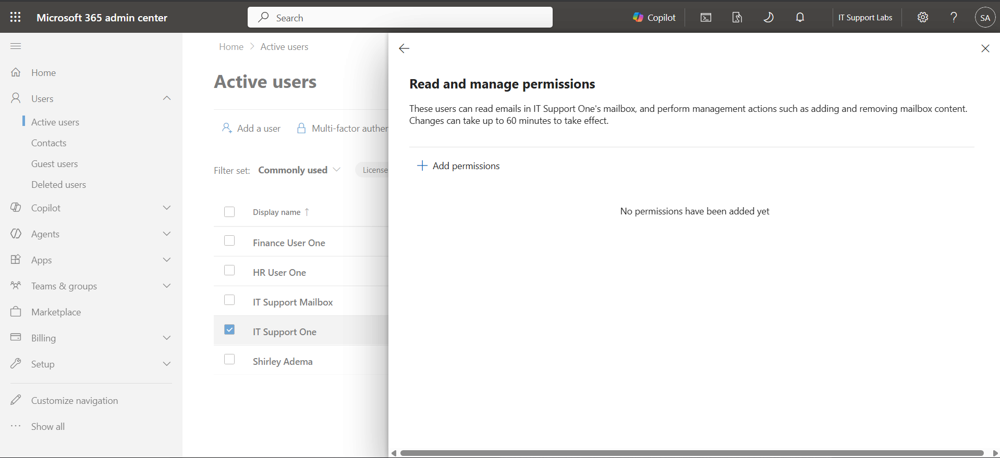
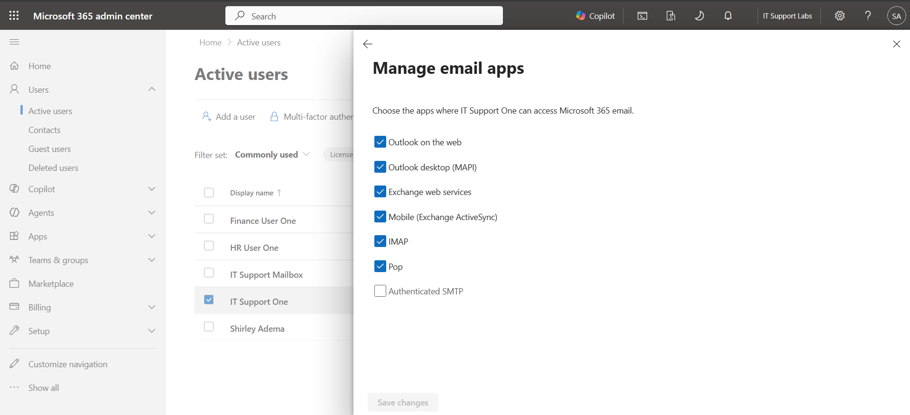
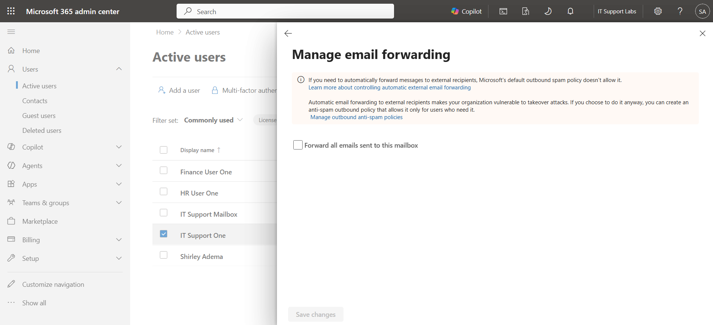
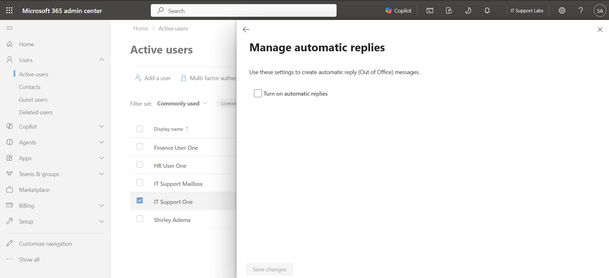
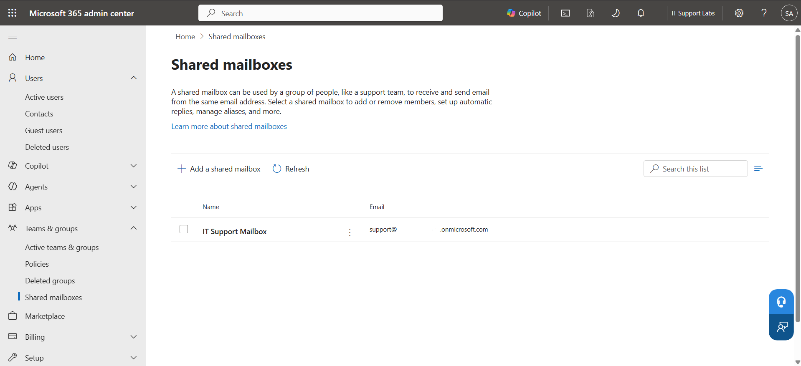
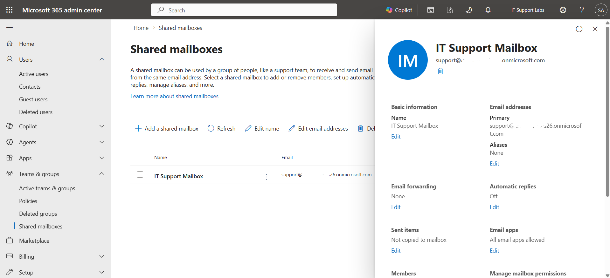
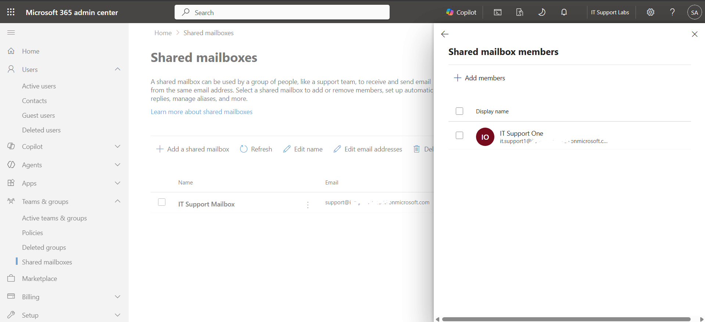
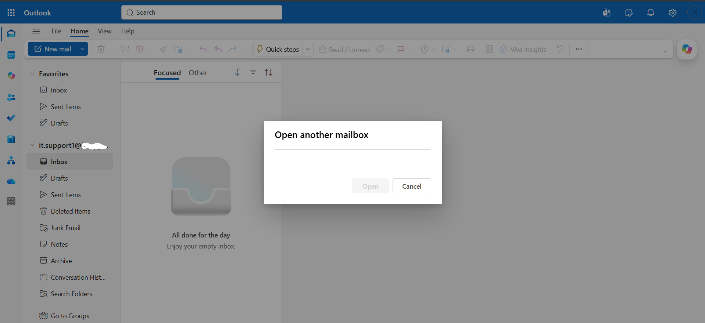
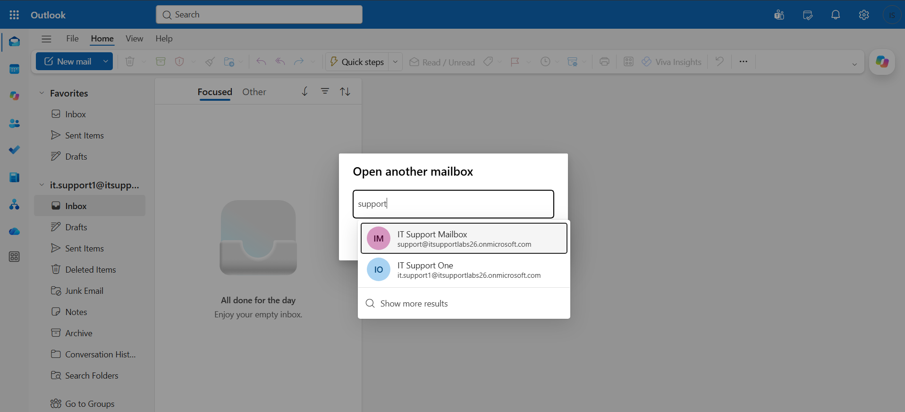
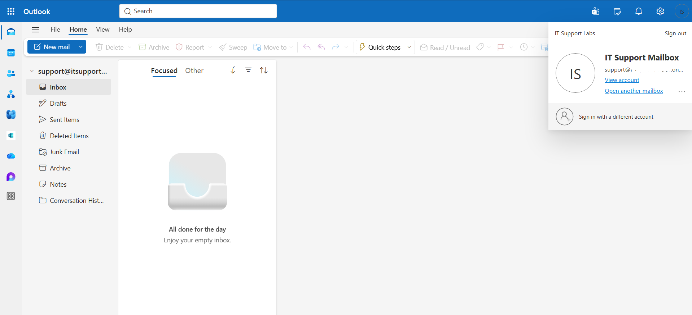

# Outlook Troubleshooting Support Lab

## Project Overview

This repository documents a hands-on Outlook troubleshooting support lab focused on common Service Desk and IT Support scenarios.

The purpose of this project is to practise Microsoft 365 mailbox support tasks, including Outlook sign-in issues, mailbox settings, shared mailbox access, email forwarding, automatic replies, email apps, mailbox permissions, and support documentation.

This lab is designed to show practical understanding of how Outlook and Microsoft 365 mailbox issues are investigated and documented in a workplace IT Support environment.

## Lab Environment

| Component | Details |
|---|---|
| Platform | Microsoft 365 Admin Centre / Outlook on the web |
| Lab Type | IT Support / Outlook Troubleshooting |
| Focus Areas | Mailbox settings, shared mailbox access, forwarding, automatic replies, email apps, user support |
| Documentation | GitHub README, lab notes, screenshots, sample tickets, knowledge base notes |

## Completed Labs

| Lab | Topic | Status |
|---|---|---|
| Lab 01 | Outlook Support Lab Setup | Completed |
| Lab 02 | User Mailbox Settings Review | Completed |
| Lab 03 | Shared Mailbox Access Troubleshooting | Completed |
| Lab 04 | Email Forwarding and Automatic Replies | Not Started |
| Lab 05 | Outlook Common Issues Knowledge Base | Not Started |
| Lab 06 | Outlook Support Tickets and Final Workflow | Not Started |

## Lab Notes

- [Lab 01 — Outlook Support Lab Setup](notes/lab-01-outlook-support-lab-setup.md)
- [Lab 02 — User Mailbox Settings Review](notes/lab-02-user-mailbox-settings-review.md)
- [Lab 03 — Shared Mailbox Access Troubleshooting](notes/lab-03-shared-mailbox-access-troubleshooting.md)

## Sample Tickets

Sample Outlook support tickets will be added during the project.

## Knowledge Base

Knowledge base notes will be added during the project.

## Screenshots

### Lab 01 — Outlook Support Lab Setup

### Lab 02 — User Mailbox Settings Review

### Lab 03 — Shared Mailbox Access Troubleshooting

## Workflow Documentation

Workflow documentation will be added during the project.

## Skills Practised

- Outlook troubleshooting
- Microsoft 365 mailbox support
- Shared mailbox access
- Mailbox permissions
- Email forwarding
- Automatic replies
- Email apps review
- User mail settings
- Service desk documentation
- IT Support workflow documentation

## What I Learned

This section will be updated as the lab progresses.
